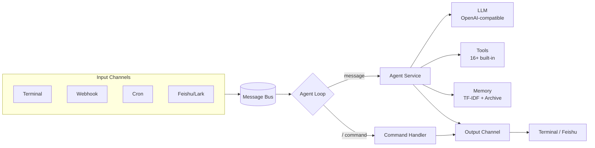

# LemonClaw

[English](README.md) | [简体中文](README_ZH-CN.md)

[](https://www.python.org/)
[](https://opensource.org/license/apache-2.0)
[](https://github.com/nl8590687/lemonclaw)
[](https://github.com/nl8590687/lemonclaw)

> An open-source, universal AI digital employee agent.

LemonClaw is an open-source, general-purpose AI agent framework that turns any LLM into a "digital employee" you can reach through multiple channels. It ships with a ReAct agent loop, 16+ built-in tools, a persistent memory system, scheduled tasks, and pluggable input/output channels — all backed by a single SQLite database.

---

## ✨ Features

- 🎧 **Multi-channel access** — Terminal, Webhook, Feishu/Lark, and Cron (scheduled tasks), all running on a unified message bus.
- 🛠️ **16+ built-in tools** — file editing, grep/glob, git, web fetch, web search, email, HTTP, shell, cron, memory, and more.
- 🧠 **Persistent memory** — TF-IDF retrieval over long-term memory chunks plus automatic session archival, so context survives across sessions.
- 🔌 **OpenAI-compatible** — works with any OpenAI-compatible API (DeepSeek, OpenAI, local servers, …).
- ⏰ **Built-in scheduling** — create and manage cron tasks at runtime; the agent can schedule its own follow-ups.
- 🐳 **One-command Docker deploy** — timezone-aware image, just mount the config dir.
- 🔒 **Safety controls** — shell tool is opt-in, file access is restricted to whitelisted directories.
- 💬 **Slash commands** — inspect tokens, manage sessions/memory/cron/skills without leaving the conversation.

---

## 🏗️ Architecture



### Project structure

```
|- .lemonclaw/    LemonClaw core config storage
|--- .env         Environment variables
|--- .env.example Example env file
|--- lemonclaw.db Global SQLite3 database (single DB for the whole project)
|- agent/         Agent implementation (loop, tools, LLM, memory)
|- channels/      Input/output devices and the message bus
|- dao/           Database models and DAO operations
|- config/        Configuration
|- tests/         Unit tests
|- loop.py        Agent loop core
|- main.py        Entry point
```

---

## 📦 Installation

**Prerequisites:** Python ≥ 3.11

### Install from source

```bash
git clone https://github.com/nl8590687/lemonclaw.git
cd lemonclaw
pip install -r requirements.txt
```

### Run with Docker

```bash
docker build --rm -t lemonclaw:0.0.1 .

# Default (UTC). Mount the config dir and expose the webhook port:
docker run -e TZ=Asia/Shanghai \
  -v ./.lemonclaw:/root/.lemonclaw \
  -p 8765:8765 \
  -d --name lemonclaw lemonclaw:0.0.1
```

---

## 🚀 Quick Start

1. **Configure environment** — copy the example and fill in your LLM API key:

   ```bash
   cp .lemonclaw/.env.example .lemonclaw/.env
   ```

   At minimum, set these in `.lemonclaw/.env`:

   ```ini
   OPENAI_BASE_URL=https://api.deepseek.com   # any OpenAI-compatible endpoint
   OPENAI_API_KEY=your-api-key
   MODEL_NAME=deepseek-v4-pro
   ```

2. **Launch:**

   ```bash
   python3 main.py
   ```

3. **Talk to your agent** in the terminal, or send a POST to the webhook (`http://127.0.0.1:8765` by default). Type `/help` to see available slash commands.

---

## ⚙️ Configuration

All configuration lives in `.lemonclaw/.env` (see `.env.example` for the full list). Main sections:

| Section | Purpose |
|---------|---------|
| `OPENAI_*` / `MODEL_*` | LLM endpoint, model, context window, temperature, timeout |
| `BOCHA_*` | Bocha web-search API (optional — enables the search tool) |
| `EMAIL_*` | SMTP server for the email tool (optional) |
| `ENABLE_BASH_TOOL` / `FILE_SAFE_DIRS` | Tool safety: shell tool on/off, file-access whitelist |
| `AGENT_REACT_MAX_ITERATIONS` / `CONTEXT_*` | Agent behavior: max ReAct iterations, retained message count |
| `ENABLE_WEBHOOK` / `WEBHOOK_*` | Webhook server: host/port, auth token, rate limit |
| `ENABLE_FEISHU` / `FEISHU_*` | Feishu/Lark app credentials |
| `ENABLE_MEMORY` / `MEMORY_*` | Persistent memory: context budget, recent sessions, search chunks, auto-archive |

---

## 📡 Channels

LemonClaw receives events through pluggable input channels and replies through matching output channels. All channels publish to a single message bus consumed by the agent loop.

| Channel | Direction | Notes |
|---------|-----------|-------|
| **Terminal** | in/out | Always on. Interactive stdin + rich terminal output. |
| **Webhook** | in | HTTP server (default `127.0.0.1:8765`). Optional `X-Auth-Token` auth and per-minute rate limit. Enable with `ENABLE_WEBHOOK=true`. |
| **Feishu/Lark** | in/out | Bot messaging. Requires `ENABLE_FEISHU=true` plus `FEISHU_APP_ID` / `FEISHU_APP_SECRET` and event subscription configured in the Feishu developer console. |
| **Cron** | in | Scheduled tasks. Always on; tasks are managed at runtime via the `/cron` command or the cron tool. |

---

## 🛠️ Built-in Tools

| Tool | Description | Availability |
|------|-------------|--------------|
| `time` | Current date/time | always |
| `http_request` | Arbitrary HTTP requests | always |
| `web_fetch` | Fetch and extract web page content | always |
| `read_file` / `write_file` / `edit_file` | File read / write / incremental edit | always (whitelisted dirs) |
| `file_list_query` | List files in a directory | always (whitelisted dirs) |
| `glob` / `grep` | File pattern match / content search | always (whitelisted dirs) |
| `git` | Common git operations | always |
| `sleep` | Wait for a duration | always |
| `cron` | Create / list / delete scheduled tasks | always |
| `bocha_search` | Web search via Bocha API | optional (needs `BOCHA_API_KEY`) |
| `email` | Send email via SMTP | optional (needs `EMAIL_*`) |
| `bash` | Run shell commands | optional (needs `ENABLE_BASH_TOOL=true`) |
| `memory` | Read / write persistent memory | optional (needs `ENABLE_MEMORY=true`) |

> Extensible: add a new tool under `agent/tools/` and register it in `create_tool_list()`.

---

## 🧠 Memory System

When `ENABLE_MEMORY=true`, LemonClaw maintains persistent memory in the single SQLite database:

- **Long-term memory chunks** — facts, preferences, and knowledge stored as searchable chunks, retrieved at query time via **TF-IDF**.
- **Session archival** — at session end, the conversation is summarized and archived so it can be recalled later.
- **Context injection** — relevant memory is injected into the agent's context under a token budget (`MEMORY_MAX_CONTEXT_TOKENS`), prioritizing core memory → recent sessions → retrieved chunks.

See [`.doc/持久化记忆读写-Spec.md`](.doc/持久化记忆读写-Spec.md) for the full design spec, or manage memory live via the `/memory`, `/chunk`, and `/session` commands.

---

## 💬 Slash Commands

Available inside any conversation (type `/help` for the full list):

| Command | Description |
|---------|-------------|
| `/help` | Show help |
| `/tokens` | Show cumulative token usage |
| `/clear` | Clear the current conversation |
| `/session` / `/session show <id>` | List recent sessions / view a session's history |
| `/resume [id]` | Resume a session in place |
| `/chunk` | Manage long-term memory chunks (list/add/get/delete/search) |
| `/memory` | Manage core memory (set/get/delete/list) |
| `/cron` | List and manage scheduled tasks (`/cron help` for subcommands) |
| `/skills` / `/skills refresh` | List available skills / refresh the skill index |
| `/exit` `/quit` `/q` | Exit |

---

## 🤝 Contributing

Contributions are welcome! Please read [AGENTS.md](AGENTS.md) first — it documents the project structure and the constraints (e.g. the single-SQLite-DB rule) that any change must respect.

1. Fork the repo and create a feature branch.
2. Keep the existing code style and architecture intact.
3. Add tests under `tests/` where applicable.
4. Open a pull request describing the change.

---

## 📄 License

Licensed under the [Apache License 2.0](LICENSE). Copyright © 2026 LemonClaw Contributors.