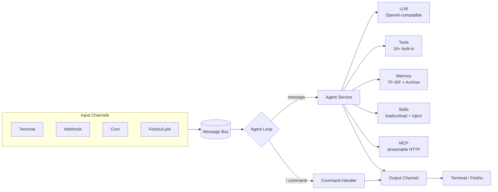

# LemonClaw

[English](README.md) | [简体中文](README_ZH-CN.md)

[](https://www.python.org/)
[](https://opensource.org/license/apache-2.0)
[](https://github.com/nl8590687/lemonclaw)
[](https://github.com/nl8590687/lemonclaw)

> An open-source, universal AI digital employee agent.

LemonClaw is an open-source, general-purpose AI agent framework that turns any LLM into a "digital employee" you can reach through multiple channels. It ships with a ReAct agent loop, 16+ built-in tools, a persistent memory system, scheduled tasks, and pluggable input/output channels — all backed by a single SQLite database.

---

## ✨ Features

- 🎧 **Multi-channel access** — Terminal, Webhook, Feishu/Lark, and Cron (scheduled tasks), all running on a unified message bus.
- 🛠️ **16+ built-in tools** — file editing, grep/glob, git, web fetch, web search, email, HTTP, shell, cron, memory, and more.
- 🧠 **Persistent memory** — TF-IDF retrieval over long-term memory chunks plus automatic session archival, so context survives across sessions.
- 🧩 **Skills** — on-demand skill packages (`SKILL.md`) with hot-reload, LRU active-set injection, sensitive-param gating, and optional script execution.
- 🔌 **MCP integration** - connect external MCP servers over Streamable HTTP; each remote tool becomes a first-class agent tool (`mcp__<server>__<tool>`), declared in `.lemonclaw/mcp.json` and hot-reloadable without losing the conversation.
- 🔀 **Multi-Agent Workflow** — build and run LangGraph-based multi-agent workflows with declarative JSON specs; sub-agents, human-in-the-loop (HITL), dynamic routing, and cross-restart resumption via persistent checkpointing.
- 🔌 **OpenAI-compatible** — works with any OpenAI-compatible API (DeepSeek, OpenAI, local servers, …).
- ⏰ **Built-in scheduling** — create and manage cron tasks at runtime; the agent can schedule its own follow-ups.
- 🐳 **One-command Docker deploy** — timezone-aware image, just mount the config dir.
- 🔒 **Safety controls** — shell tool is opt-in, file access is restricted to whitelisted directories.
- 💬 **Slash commands** — inspect tokens, manage sessions/memory/cron/skills without leaving the conversation.

---

## 🏗️ Architecture



### Project structure

```
|- .lemonclaw/    LemonClaw core config storage
|--- .env         Environment variables
|--- .env.example Example env file
|--- mcp.json     MCP server config (Streamable HTTP; gitignored - contains secrets)
|--- lemonclaw.db Global SQLite3 database (single DB for the whole project)
|- agent/         Agent implementation (loop, tools, LLM, memory, skills, MCP)
|- channels/      Input/output devices and the message bus
|- dao/           Database models and DAO operations
|- config/        Configuration
|- tests/         Unit tests
|- loop.py        Agent loop core
|- main.py        Entry point
```

---

## 📦 Installation

**Prerequisites:** Python ≥ 3.11

### Install from source

```bash
git clone https://github.com/nl8590687/lemonclaw.git
cd lemonclaw
pip install -r requirements.txt
```

### Run with Docker

```bash
docker build --rm -t lemonclaw:0.0.1 .

# Default (UTC). Mount the config dir and expose the webhook port:
docker run -e TZ=Asia/Shanghai \
  -v ./.lemonclaw:/root/.lemonclaw \
  -p 8765:8765 \
  -d --name lemonclaw lemonclaw:0.0.1
```

---

## 🚀 Quick Start

1. **Configure environment** — copy the example and fill in your LLM API key:

   ```bash
   cp .lemonclaw/.env.example .lemonclaw/.env
   ```

   At minimum, set these in `.lemonclaw/.env`:

   ```ini
   OPENAI_BASE_URL=https://api.deepseek.com   # any OpenAI-compatible endpoint
   OPENAI_API_KEY=your-api-key
   MODEL_NAME=deepseek-v4-pro
   ```

2. **Launch:**

   ```bash
   python3 main.py
   ```

3. **Talk to your agent** in the terminal, or send a POST to the webhook (`http://127.0.0.1:8765` by default). Type `/help` to see available slash commands.

---

## ⚙️ Configuration

All configuration lives in `.lemonclaw/.env` (see `.env.example` for the full list). Main sections:

| Section | Purpose |
|---------|---------|
| `OPENAI_*` / `MODEL_*` | LLM endpoint, model, context window, temperature, timeout |
| `BOCHA_*` | Bocha web-search API (optional — enables the search tool) |
| `EMAIL_*` | SMTP server for the email tool (optional) |
| `ENABLE_BASH_TOOL` / `FILE_SAFE_DIRS` | Tool safety: shell tool on/off, file-access whitelist |
| `AGENT_REACT_MAX_ITERATIONS` / `CONTEXT_*` | Agent behavior: max ReAct iterations, retained message count |
| `ENABLE_WEBHOOK` / `WEBHOOK_*` | Webhook server: host/port, auth token, rate limit |
| `ENABLE_FEISHU` / `FEISHU_*` | Feishu/Lark app credentials |
| `ENABLE_MEMORY` / `MEMORY_*` | Persistent memory: context budget, recent sessions, search chunks, auto-archive |
| `ENABLE_SKILLS` / `ENABLE_SKILL_SCRIPT` / `MAX_ACTIVE_SKILLS` / `PIP_INDEX_URL` / `NPM_REGISTRY` | Skills: master switch, script-execution gate, active-set cap, pip/npm dependency mirrors |
| `ENABLE_MCP` / `MCP_CONNECT_TIMEOUT` / `MCP_CALL_TIMEOUT` / `MCP_MAX_TOOLS` / `MCP_RESULT_MAX_CHARS` | MCP integration: master switch, connect/call timeouts, per-server tool cap, result truncation |
| `ENABLE_WORKFLOW` / `WORKFLOW_*` | Multi-Agent Workflow: master switch, recursion limit, nesting max, node/branch limits, result truncation, worker pool size, HITL handler |

---

## 📡 Channels

LemonClaw receives events through pluggable input channels and replies through matching output channels. All channels publish to a single message bus consumed by the agent loop.

| Channel | Direction | Notes |
|---------|-----------|-------|
| **Terminal** | in/out | Always on. Interactive stdin + rich terminal output. |
| **Webhook** | in | HTTP server (default `127.0.0.1:8765`). Optional `X-Auth-Token` auth and per-minute rate limit. Enable with `ENABLE_WEBHOOK=true`. |
| **Feishu/Lark** | in/out | Bot messaging. Requires `ENABLE_FEISHU=true` plus `FEISHU_APP_ID` / `FEISHU_APP_SECRET` and event subscription configured in the Feishu developer console. |
| **Cron** | in | Scheduled tasks. Always on; tasks are managed at runtime via the `/cron` command or the cron tool. |

---

## 🛠️ Built-in Tools

| Tool | Description | Availability |
|------|-------------|--------------|
| `time` | Current date/time | always |
| `http_request` | Arbitrary HTTP requests | always |
| `web_fetch` | Fetch and extract web page content | always |
| `read_file` / `write_file` / `edit_file` | File read / write / incremental edit | always (whitelisted dirs) |
| `file_list_query` | List files in a directory | always (whitelisted dirs) |
| `glob` / `grep` | File pattern match / content search | always (whitelisted dirs) |
| `git` | Common git operations | always |
| `sleep` | Wait for a duration | always |
| `cron` | Create / list / delete scheduled tasks | always |
| `bocha_search` | Web search via Bocha API | optional (needs `BOCHA_API_KEY`) |
| `email` | Send email via SMTP | optional (needs `EMAIL_*`) |
| `bash` | Run shell commands | optional (needs `ENABLE_BASH_TOOL=true`) |
| `memory` | Read / write persistent memory | optional (needs `ENABLE_MEMORY=true`) |
| `load_skill` / `unload_skill` | Activate / unload a skill (instructions injected by the middleware) | optional (needs `ENABLE_SKILLS=true`) |
| `run_skill_script` | Run a skill's Python/Node script in its isolated env | optional (needs `ENABLE_SKILL_SCRIPT=true`) |
| `mcp__<server>__<tool>` | Tools from connected MCP servers (Streamable HTTP) | optional (needs `ENABLE_MCP=true` + `.lemonclaw/mcp.json`) |
| `workflow_define` / `workflow_execute` / `workflow_resume` / `workflow_cancel` / `workflow_list` / `workflow_inspect_run` / `workflow_delete` | Define, run, resume, manage multi-agent workflows | optional (needs `ENABLE_WORKFLOW=true`) |

> Extensible: add a new tool under `agent/tools/` and register it in `create_tool_list()`.

---

## 🧠 Memory System

When `ENABLE_MEMORY=true`, LemonClaw maintains persistent memory in the single SQLite database:

- **Long-term memory chunks** — facts, preferences, and knowledge stored as searchable chunks, retrieved at query time via **TF-IDF**.
- **Session archival** — at session end, the conversation is summarized and archived so it can be recalled later.
- **Context injection** — relevant memory is injected into the agent's context under a token budget (`MEMORY_MAX_CONTEXT_TOKENS`), prioritizing core memory → recent sessions → retrieved chunks.

To manage memory live via the `/memory`, `/chunk`, and `/session` commands.

---

## 🧩 Skills System

When `ENABLE_SKILLS=true` (default), LemonClaw turns reusable workflows into on-demand **skill packages**. Drop a skill folder under `.lemonclaw/skills/` and the agent can discover and load it at runtime.

### Skill package format (OpenClaw-compatible)

```
.lemonclaw/skills/<name>-<version>/
├── SKILL.md         # required - YAML frontmatter (name/description/tags) + markdown instructions
├── _meta.json       # optional - slug/version metadata
├── requirements.txt # optional - Python deps (enables run_skill_script for this skill)
├── package.json     # optional - Node deps
└── *.md             # optional - extra reference docs (appended to the loaded content)
```

`SKILL.md` frontmatter example:

```yaml
---
name: weekly-report
description: Generate a weekly work summary
tags: [report, work]
metadata:
  openclaw:
    emoji: 📊
    requires:
      env:
        - BOCHA_API_KEY   # skill declares required env vars
    primaryEnv: BOCHA_API_KEY
---
```

### How it works

- **Discovery** - on startup and `/skills reload`, the skill directory is scanned and metadata is indexed in the SQLite DB.
- **Routing** - the summary (name + description + tags) of all *available* skills is injected into the system prompt every turn, so the LLM can pick the right skill.
- **Activation** - the agent calls `load_skill(name)` to activate a skill; its full instructions are then injected every turn by the context middleware (not stored in message history, so context compression can't lose them).
- **LRU + unload** - at most `MAX_ACTIVE_SKILLS` (default 5) skills stay active (LRU eviction); the agent calls `unload_skill(name)` when done.
- **Hot reload** - add/modify/delete skill packages, run `/skills reload`, and changes take effect immediately without restarting.

### Sensitive parameters (API keys, etc.)

Skills declare required env vars in frontmatter. Configure them **once** in `.lemonclaw/.env`; `/skills reload` picks up new keys. A skill whose required env vars are missing is marked `⚠ missing config` and hidden from the agent. Secrets never enter the LLM context - skill bodies use `${VAR}` placeholders that `http_request` resolves server-side.

### Script skills (Python / Node)

If a skill ships a `requirements.txt` / `package.json`, install its deps once with `/skills setup <name>` (isolated venv / `node_modules`, China-friendly mirror defaults). Run scripts via the `run_skill_script` tool (gated by `ENABLE_SKILL_SCRIPT`, off by default; path-contained, no shell, cross-platform). Node skills require `node`/`npm` preinstalled in the image.

---

## 🔌 MCP Integration

When `ENABLE_MCP=true` (default), LemonClaw acts as an **MCP client** over **Streamable HTTP** (stdio is not supported). Each tool exposed by a connected MCP server is registered as a first-class agent tool named `mcp__<server_id>__<tool>`, so the LLM can call it directly with full parameter schemas.

> LemonClaw is MCP **client only** (it consumes external tools); it does not expose itself as an MCP server.

### Configure servers (`.lemonclaw/mcp.json`)

Servers are declared in `.lemonclaw/mcp.json` - a JSON object keyed by `server_id` (object keys are unique by definition, and the id doubles as the tool-name prefix). Edit the file and run `/mcp reload` (or restart) - no CLI needed, which suits Docker / read-only deployments.

```json
{
  "mindoc": {
    "url": "https://mindoc.example.com/mcp",
    "headers": {"Authorization": "Bearer ghs_xxxxxxxx"},
    "auto_connect": true
  },
  "github": {
    "url": "https://api.github.example/mcp",
    "headers": {},
    "auto_connect": true
  }
}
```

- `url` - the MCP Streamable HTTP endpoint.
- `headers` - extra request headers. **Auth secrets go directly here** (see security below).
- `auto_connect` - whether to connect on startup (default `true`).
- `enabled` is **not** in the file - it's a DB management state toggled by `/mcp enable|disable`.

A template is provided at `.lemonclaw/mcp.json.example` (placeholder values, safe to commit).

### Security: secrets never reach the LLM

`headers` (including tokens) are **server-side connection config** held by `MCPConnection`. They are never placed in the tool name / description / arguments / result, so they never enter the LLM context, the DB-mirrored checkpointer, or the LLM API payload. Because `mcp.json` contains secrets, it is **gitignored**; share configs via the `mcp.json.example` template. (This differs from Skills, which need `${VAR}` placeholders because skill bodies are injected into the system prompt - MCP headers are not.)

### How it works

- **Discovery** - on startup and `/mcp reload`, each enabled server is connected: `initialize` handshake -> `Mcp-Session-Id` -> `notifications/initialized` -> `tools/list`. Each remote tool becomes an `mcp__<id>__<tool>` agent tool.
- **Calling** - the LLM calls the tool; `MCPConnection` issues `tools/call` (parsing both `application/json` and `text/event-stream` responses), then formats and truncates the result.
- **Hot reload** - `/mcp reload` (or `add`/`remove`/`enable`/`disable`/`reconnect`) re-reads `mcp.json`, reconnects, and **rebuilds the agent while preserving the checkpointer** - the current conversation continues uninterrupted.
- **Limits** - per-server `MCP_MAX_TOOLS` (default 100) and a global hard cap of 200 registered MCP tools; results truncated to `MCP_RESULT_MAX_CHARS` (default 20000).
- **Resilience** - one unreachable server doesn't affect others or built-in tools; `ENABLE_MCP=false` or init failure degrades to "no MCP tools" without blocking the agent.

### Manage at runtime

`/mcp` commands (type `/mcp help` for the full list): `list`, `add <id> <url> [headers_json]` (writes back to `mcp.json`), `remove`, `enable`, `disable`, `tools <id>`, `reconnect`, `reload`, `call <id> <tool> [json_args]`. Command output never displays header values.

---

## 🔀 Multi-Agent Workflow

When `ENABLE_WORKFLOW=true` (default), LemonClaw can build and run **LangGraph-based multi-agent workflows**. The architecture features **two "in-the-loop" participants**: the **main agent** and the **human**. The main agent is not just the orchestrator who defines workflows — it is an **active participant in the loop itself**: it can be called back as a node during execution (`main_agent` nodes), inspect and control in-flight runs at any time (supervisor commands), and serve as the sole interface through which humans interact with the workflow (HITL). This is fundamentally different from a simple "workflow result callback" — **the main agent is a first-class citizen of the workflow loop, not a passive endpoint**. **`loop_forever` is never modified** — workflows and the LangGraphLoop events integrate via the existing message bus and agent tools.

### Key capabilities

- **Main agent in the loop** vs. **Human in the loop** — two independent "loop participants":
  - **Main agent in the loop**: the main agent is an active participant. It can be called back as a `main_agent` node during execution (with full session memory and workflow tools, enabling dynamic recursion). It can also **inspect, control, and adjust** in-flight runs **at any time** — not just at predefined callback points — via supervisor commands (`/wf inspect`, `/wf inject`) and tools (`workflow_inspect_run`, `workflow_inject`). This is the "main-agent-in-the-loop", distinct from passive result delivery.
  - **Human in the loop**: `human` nodes pause execution and notify the user **through the main agent** (the main agent is the human's sole interface — humans never interact with sub-agents directly). The `run_id` is carried in the message text bidirectionally; the main agent extracts it and calls `workflow_resume(run_id, answer)`.
- **Declarative specs** — define workflows via a single `workflow_define(name, spec)` call (JSON: `state_schema` / `nodes` / `edges` / `conditionals`). No code generation required.
- **Sub-agents** (`subagent` nodes) — curated tools + custom system prompt, inherits nothing from the main agent. A `BaseSubAgent` + `GeneralSubAgent` hierarchy with a pluggable registry for future specialized types (browser, SSH, etc.).
- **Beyond DAG** — conditional edges support LLM-based and state-field routing, plus cyclic loops (with `recursion_limit` protection).
- **Persistent execution** — runs are checkpointed via `SqliteSaver` in the single `.lemonclaw/lemonclaw.db`. Paused runs survive process restarts and can be resumed hours/days later.
- **Background worker pool** — workflow segments execute in a bounded thread pool (`WORKFLOW_WORKER_POOL_SIZE`, default 4) so the main agent loop never blocks.
- **One-shot workflows** — mark `"one_shot": true` in the spec and the definition, runs, and checkpoints are auto-cleaned on completion.

### Define and run in 3 steps

**1. Define** — the main agent calls `workflow_define` with a JSON spec:

```json
{
  "state_schema": [{"name": "answer", "type": "str"}],
  "nodes": [
    {"name": "ask", "kind": "human", "config": {"question": "Please confirm the scope.", "output_field": "answer"}},
    {"name": "summarize", "kind": "subagent", "config": {"type": "general", "system_prompt": "You are a summarizer.", "tools": ["web_search"], "task": "Summarize: {answer}", "output_field": "summary"}}
  ],
  "edges": [{"src": "START", "dst": "ask"}, {"src": "ask", "dst": "summarize"}, {"src": "summarize", "dst": "END"}]
}
```

**2. Execute** — the main agent calls `workflow_execute("workflow_id")`. The workflow runs in a background worker thread; on a `human` node it pauses and sends a `LangGraphLoop` message to the main agent (via the normal message bus — no special dispatch).

**3. Resume (HITL)** — the user replies with the `run_id` in the text (e.g. `wf_run_xxx agreed, limit to one week`). The main agent extracts the `run_id` and calls `workflow_resume(run_id, answer)` to continue.

### Manage at runtime

`/wf` commands (type `/wf help` for the full list): `list`, `runs [status]` (active/running/paused/all), `resume <id> <value>`, `cancel <id>`, `delete <id>`. The main agent also has `workflow_list` (list active/paused runs), `workflow_inspect_run`, and `workflow_inject` tools.

> `python` nodes and the sandbox mechanism are **not implemented** in this release; they will be added later under a shared sandbox with the skill script system.

---

## 💬 Slash Commands

Available inside any conversation (type `/help` for the full list):

| Command | Description |
|---------|-------------|
| `/help` | Show help |
| `/tokens` | Show cumulative token usage |
| `/clear` | Clear the current conversation |
| `/session` / `/session show <id>` | List recent sessions / view a session's history |
| `/resume [id]` | Resume a session in place |
| `/chunk` | Manage long-term memory chunks (list/add/get/delete/search) |
| `/memory` | Manage core memory (set/get/delete/list) |
| `/cron` | List and manage scheduled tasks (`/cron help` for subcommands) |
| `/skills` | List and manage skills (`/skills help` for subcommands: list/show/enable/disable/unload/setup/reload) |
| `/mcp` | List and manage MCP servers (`/mcp help` for subcommands: list/add/remove/enable/disable/tools/reconnect/reload/call) |
| `/wf` | List and manage workflows (`/wf help` for subcommands: list/runs/resume/cancel/delete) |
| `/exit` `/quit` `/q` | Exit |

---

## 🤝 Contributing

Contributions are welcome! Please read [AGENTS.md](AGENTS.md) first — it documents the project structure and the constraints (e.g. the single-SQLite-DB rule) that any change must respect.

1. Fork the repo and create a feature branch.
2. Keep the existing code style and architecture intact.
3. Add tests under `tests/` where applicable.
4. Open a pull request describing the change.

---

## 📄 License

Licensed under the [Apache License 2.0](LICENSE). Copyright © 2026 LemonClaw Contributors.