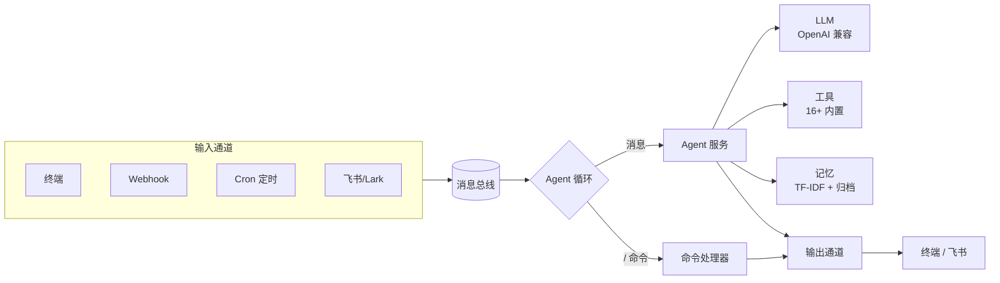

# LemonClaw

[English](README.md) | [简体中文](README_ZH-CN.md)

[](https://www.python.org/)
[](https://opensource.org/license/apache-2.0)
[](https://github.com/nl8590687/lemonclaw)
[](https://github.com/nl8590687/lemonclaw)

> 一个开源的通用 AI 数字员工 Agent。

LemonClaw 是一个开源的通用 AI Agent 框架，能把任意大模型变成可通过多通道触达的"数字员工"。内置 ReAct Agent 循环、16+ 开箱即用的工具、持久化记忆系统、定时任务与可插拔的输入/输出通道——全部数据落在一个 SQLite 数据库中。

---

## ✨ 特性

- 🎧 **多通道接入** —— 终端、Webhook、飞书/Lark、定时任务（Cron），统一消息总线驱动。
- 🛠️ **16+ 内置工具** —— 文件编辑、grep/glob、git、网页抓取、联网搜索、邮件、HTTP、Shell、定时任务、记忆等。
- 🧠 **持久化记忆** —— 基于 TF-IDF 的长期记忆块检索 + 会话自动归档，让上下文跨会话保留。
- 🔌 **OpenAI 兼容** —— 支持任意 OpenAI 兼容接口（DeepSeek、OpenAI、本地服务……）。
- ⏰ **内置调度** —— 运行时创建与管理定时任务，Agent 可自行安排后续动作。
- 🐳 **一键 Docker 部署** —— 镜像支持时区配置，挂载配置目录即可运行。
- 🔒 **安全管控** —— Shell 工具按需开启，文件访问限定在白名单目录。
- 💬 **斜杠命令** —— 不离开对话即可查看 Token、管理会话/记忆/定时任务/技能。

---

## 🏗️ 架构



### 项目结构

```
|- .lemonclaw/    LemonClaw 核心配置存储目录
|--- .env         环境变量配置文件
|--- .env.example 环境变量配置样例文件
|--- lemonclaw.db 全局 SQLite3 数据库（整个项目仅此一个库）
|- agent/         Agent 实现模块（循环、工具、LLM、记忆）
|- channels/      输入输出设备和通道、消息总线
|- dao/           数据库 model 和 dao 操作模块
|- config/        配置相关代码模块
|- tests/         单元测试目录
|- loop.py        Agent Loop 核心代码
|- main.py        启动入口代码
```

---

## 📦 安装

**环境要求：** Python ≥ 3.11

### 源码安装

```bash
git clone https://github.com/nl8590687/lemonclaw.git
cd lemonclaw
pip install -r requirements.txt
```

### Docker 部署

```bash
docker build --rm -t lemonclaw:0.0.1 .

# 默认 UTC。挂载配置目录并暴露 webhook 端口：
docker run -e TZ=Asia/Shanghai \
  -v ./.lemonclaw:/root/.lemonclaw \
  -p 8765:8765 \
  -d --name lemonclaw lemonclaw:0.0.1
```

---

## 🚀 快速开始

1. **配置环境** —— 复制样例文件并填入你的 LLM API Key：

   ```bash
   cp .lemonclaw/.env.example .lemonclaw/.env
   ```

   至少在 `.lemonclaw/.env` 中设置以下几项：

   ```ini
   OPENAI_BASE_URL=https://api.deepseek.com   # 任意 OpenAI 兼容接口
   OPENAI_API_KEY=your-api-key
   MODEL_NAME=deepseek-v4-pro
   ```

2. **启动：**

   ```bash
   python3 main.py
   ```

3. **与你的 Agent 对话** —— 在终端交互，或向 webhook（默认 `http://127.0.0.1:8765`）发 POST 请求。输入 `/help` 查看全部斜杠命令。

---

## ⚙️ 配置

所有配置位于 `.lemonclaw/.env`（完整项见 `.env.example`）。主要分组：

| 分组 | 用途 |
|------|------|
| `OPENAI_*` / `MODEL_*` | LLM 接口地址、模型、上下文窗口、温度、超时 |
| `BOCHA_*` | 博查联网搜索 API（可选，开启后生效搜索工具） |
| `EMAIL_*` | 邮件工具的 SMTP 服务器配置（可选） |
| `ENABLE_BASH_TOOL` / `FILE_SAFE_DIRS` | 工具安全：Shell 工具开关、文件访问白名单 |
| `AGENT_REACT_MAX_ITERATIONS` / `CONTEXT_*` | Agent 行为：ReAct 最大迭代次数、保留消息数 |
| `ENABLE_WEBHOOK` / `WEBHOOK_*` | Webhook 服务：主机/端口、鉴权 Token、频率限制 |
| `ENABLE_FEISHU` / `FEISHU_*` | 飞书/Lark 应用凭证 |
| `ENABLE_MEMORY` / `MEMORY_*` | 持久化记忆：上下文预算、最近会话数、检索块上限、自动归档 |

---

## 📡 通道

LemonClaw 通过可插拔的输入通道接收事件，并通过对应的输出通道回复。所有通道都发布到同一条消息总线，由 Agent 循环消费。

| 通道 | 方向 | 说明 |
|------|------|------|
| **终端** | 输入/输出 | 始终开启。交互式 stdin + rich 终端输出。 |
| **Webhook** | 输入 | HTTP 服务（默认 `127.0.0.1:8765`）。可选 `X-Auth-Token` 鉴权与每分钟限频。`ENABLE_WEBHOOK=true` 开启。 |
| **飞书/Lark** | 输入/输出 | 机器人消息。需 `ENABLE_FEISHU=true` 加上 `FEISHU_APP_ID` / `FEISHU_APP_SECRET`，并在飞书开发者后台配置事件订阅。 |
| **Cron** | 输入 | 定时任务。始终开启；任务可在运行时通过 `/cron` 命令或 cron 工具管理。 |

---

## 🛠️ 内置工具

| 工具 | 说明 | 可用性 |
|------|------|--------|
| `time` | 当前日期/时间 | 始终 |
| `http_request` | 任意 HTTP 请求 | 始终 |
| `web_fetch` | 抓取并提取网页内容 | 始终 |
| `read_file` / `write_file` / `edit_file` | 文件读 / 写 / 增量编辑 | 始终（白名单目录） |
| `file_list_query` | 列出目录下的文件 | 始终（白名单目录） |
| `glob` / `grep` | 文件通配匹配 / 内容搜索 | 始终（白名单目录） |
| `git` | 常用 git 操作 | 始终 |
| `sleep` | 等待一段时长 | 始终 |
| `cron` | 创建 / 列出 / 删除定时任务 | 始终 |
| `bocha_search` | 通过博查 API 联网搜索 | 可选（需 `BOCHA_API_KEY`） |
| `email` | 通过 SMTP 发送邮件 | 可选（需 `EMAIL_*`） |
| `bash` | 执行 Shell 命令 | 可选（需 `ENABLE_BASH_TOOL=true`） |
| `memory` | 读写持久化记忆 | 可选（需 `ENABLE_MEMORY=true`） |

> 可扩展：在 `agent/tools/` 下新增工具，并在 `create_tool_list()` 中注册即可。

---

## 🧠 记忆系统

当 `ENABLE_MEMORY=true` 时，LemonClaw 会在唯一的 SQLite 数据库中维护持久化记忆：

- **长期记忆块** —— 以可检索的块形式存储事实、偏好与知识，查询时通过 **TF-IDF** 召回。
- **会话归档** —— 会话结束时自动摘要归档，便于后续召回。
- **上下文注入** —— 在 Token 预算（`MEMORY_MAX_CONTEXT_TOKENS`）内将相关记忆注入 Agent 上下文，优先级：核心记忆 → 最近会话 → 检索块。

完整设计见 [`.doc/持久化记忆读写-Spec.md`](.doc/持久化记忆读写-Spec.md)，也可通过 `/memory`、`/chunk`、`/session` 命令在运行时管理记忆。

---

## 💬 斜杠命令

在任意对话中可用（输入 `/help` 查看完整列表）：

| 命令 | 说明 |
|------|------|
| `/help` | 显示帮助 |
| `/tokens` | 查看累计 Token 用量 |
| `/clear` | 清空当前对话 |
| `/session` / `/session show <id>` | 列出最近会话 / 查看某会话历史 |
| `/resume [id]` | 原地续写指定 id 或最近一次会话 |
| `/chunk` | 管理长期记忆块（list/add/get/delete/search） |
| `/memory` | 管理核心记忆（set/get/delete/list） |
| `/cron` | 列出并管理定时任务（`/cron help` 查看子命令） |
| `/skills` / `/skills refresh` | 列出可用技能 / 刷新技能索引 |
| `/exit` `/quit` `/q` | 退出 |

---

## 🤝 参与贡献

欢迎贡献！请先阅读 [AGENTS.md](AGENTS.md) —— 其中说明了项目结构与任何改动都必须遵守的约束（如单 SQLite 库规则）。

1. Fork 仓库并创建特性分支。
2. 保持现有代码风格与架构不变。
3. 在 `tests/` 下补充相应测试。
4. 提交 Pull Request 描述你的改动。

---

## 📄 许可证

基于 [Apache License 2.0](LICENSE) 开源。Copyright © 2026 LemonClaw Contributors.
