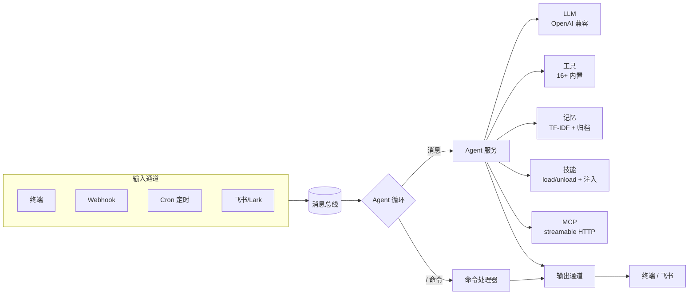

# LemonClaw

[English](README.md) | [简体中文](README_ZH-CN.md)

[](https://www.python.org/)
[](https://opensource.org/license/apache-2.0)
[](https://github.com/nl8590687/lemonclaw)
[](https://github.com/nl8590687/lemonclaw)

> 一个开源的通用 AI 数字员工 Agent。

LemonClaw 是一个开源的通用 AI Agent 框架，能把任意大模型变成可通过多通道触达的"数字员工"。内置 ReAct Agent 循环、16+ 开箱即用的工具、持久化记忆系统、定时任务与可插拔的输入/输出通道——全部数据落在一个 SQLite 数据库中。

---

## ✨ 特性

- 🎧 **多通道接入** —— 终端、Webhook、飞书/Lark、定时任务（Cron），统一消息总线驱动。
- 🛠️ **16+ 内置工具** —— 文件编辑、grep/glob、git、网页抓取、联网搜索、邮件、HTTP、Shell、定时任务、记忆等。
- 🧠 **持久化记忆** —— 基于 TF-IDF 的长期记忆块检索 + 会话自动归档，让上下文跨会话保留。
- 🧩 **技能系统** -- 按需加载的技能包（`SKILL.md`），支持热加载、LRU 活跃集注入、敏感参数门禁与可选脚本执行。
- 🔌 **MCP 接入** -- 通过 Streamable HTTP 接入外部 MCP 服务端；每个远程工具注册为原生 Agent 工具（`mcp__<服务名>__<工具名>`），在 `.lemonclaw/mcp.json` 声明，支持热重载且不中断当前对话。
- 🔀 **多 Agent 工作流** -- 构建并运行基于 LangGraph 的多 Agent 工作流；声明式 JSON spec、子 Agent、人在回路（HITL）、动态路由、跨重启续跑。
- 🔌 **OpenAI 兼容** —— 支持任意 OpenAI 兼容接口（DeepSeek、OpenAI、本地服务……）。
- ⏰ **内置调度** —— 运行时创建与管理定时任务，Agent 可自行安排后续动作。
- 🐳 **一键 Docker 部署** —— 镜像支持时区配置，挂载配置目录即可运行。
- 🔒 **安全管控** —— Shell 工具按需开启，文件访问限定在白名单目录。
- 💬 **斜杠命令** —— 不离开对话即可查看 Token、管理会话/记忆/定时任务/技能。

---

## 🏗️ 架构



### 项目结构

```
|- .lemonclaw/    LemonClaw 核心配置存储目录
|--- .env         环境变量配置文件
|--- .env.example 环境变量配置样例文件
|--- mcp.json     MCP 服务端配置（Streamable HTTP；含密钥，已 gitignore）
|--- lemonclaw.db 全局 SQLite3 数据库（整个项目仅此一个库）
|- agent/         Agent 实现模块（循环、工具、LLM、记忆、技能、MCP）
|- channels/      输入输出设备和通道、消息总线
|- dao/           数据库 model 和 dao 操作模块
|- config/        配置相关代码模块
|- tests/         单元测试目录
|- loop.py        Agent Loop 核心代码
|- main.py        启动入口代码
```

---

## 📦 安装

**环境要求：** Python ≥ 3.11

### 源码安装

```bash
git clone https://github.com/nl8590687/lemonclaw.git
cd lemonclaw
pip install -r requirements.txt
```

### Docker 部署

```bash
docker build --rm -t lemonclaw:0.0.1 .

# 默认 UTC。挂载配置目录并暴露 webhook 端口：
docker run -e TZ=Asia/Shanghai \
  -v ./.lemonclaw:/root/.lemonclaw \
  -p 8765:8765 \
  -d --name lemonclaw lemonclaw:0.0.1
```

---

## 🚀 快速开始

1. **配置环境** —— 复制样例文件并填入你的 LLM API Key：

   ```bash
   cp .lemonclaw/.env.example .lemonclaw/.env
   ```

   至少在 `.lemonclaw/.env` 中设置以下几项：

   ```ini
   OPENAI_BASE_URL=https://api.deepseek.com   # 任意 OpenAI 兼容接口
   OPENAI_API_KEY=your-api-key
   MODEL_NAME=deepseek-v4-pro
   ```

2. **启动：**

   ```bash
   python3 main.py
   ```

3. **与你的 Agent 对话** —— 在终端交互，或向 webhook（默认 `http://127.0.0.1:8765`）发 POST 请求。输入 `/help` 查看全部斜杠命令。

---

## ⚙️ 配置

所有配置位于 `.lemonclaw/.env`（完整项见 `.env.example`）。主要分组：

| 分组 | 用途 |
|------|------|
| `OPENAI_*` / `MODEL_*` | LLM 接口地址、模型、上下文窗口、温度、超时 |
| `BOCHA_*` | 博查联网搜索 API（可选，开启后生效搜索工具） |
| `EMAIL_*` | 邮件工具的 SMTP 服务器配置（可选） |
| `ENABLE_BASH_TOOL` / `FILE_SAFE_DIRS` | 工具安全：Shell 工具开关、文件访问白名单 |
| `AGENT_REACT_MAX_ITERATIONS` / `CONTEXT_*` | Agent 行为：ReAct 最大迭代次数、保留消息数 |
| `ENABLE_WEBHOOK` / `WEBHOOK_*` | Webhook 服务：主机/端口、鉴权 Token、频率限制 |
| `ENABLE_FEISHU` / `FEISHU_*` | 飞书/Lark 应用凭证 |
| `ENABLE_MEMORY` / `MEMORY_*` | 持久化记忆：上下文预算、最近会话数、检索块上限、自动归档 |
| `ENABLE_SKILLS` / `ENABLE_SKILL_SCRIPT` / `MAX_ACTIVE_SKILLS` / `PIP_INDEX_URL` / `NPM_REGISTRY` | 技能系统：总开关、脚本执行开关、活跃集上限、pip/npm 依赖镜像源 |
| `ENABLE_MCP` / `MCP_CONNECT_TIMEOUT` / `MCP_CALL_TIMEOUT` / `MCP_MAX_TOOLS` / `MCP_RESULT_MAX_CHARS` | MCP 接入：总开关、连接/调用超时、单服务端工具数上限、结果截断阈值 |
| `ENABLE_WORKFLOW` / `WORKFLOW_*` | 多 Agent 工作流：总开关、递归上限、嵌套上限、节点/分支上限、结果截断、Worker 池大小、HITL handler |

---

## 📡 通道

LemonClaw 通过可插拔的输入通道接收事件，并通过对应的输出通道回复。所有通道都发布到同一条消息总线，由 Agent 循环消费。

| 通道 | 方向 | 说明 |
|------|------|------|
| **终端** | 输入/输出 | 始终开启。交互式 stdin + rich 终端输出。 |
| **Webhook** | 输入 | HTTP 服务（默认 `127.0.0.1:8765`）。可选 `X-Auth-Token` 鉴权与每分钟限频。`ENABLE_WEBHOOK=true` 开启。 |
| **飞书/Lark** | 输入/输出 | 机器人消息。需 `ENABLE_FEISHU=true` 加上 `FEISHU_APP_ID` / `FEISHU_APP_SECRET`，并在飞书开发者后台配置事件订阅。 |
| **Cron** | 输入 | 定时任务。始终开启；任务可在运行时通过 `/cron` 命令或 cron 工具管理。 |

---

## 🛠️ 内置工具

| 工具 | 说明 | 可用性 |
|------|------|--------|
| `time` | 当前日期/时间 | 始终 |
| `http_request` | 任意 HTTP 请求 | 始终 |
| `web_fetch` | 抓取并提取网页内容 | 始终 |
| `read_file` / `write_file` / `edit_file` | 文件读 / 写 / 增量编辑 | 始终（白名单目录） |
| `file_list_query` | 列出目录下的文件 | 始终（白名单目录） |
| `glob` / `grep` | 文件通配匹配 / 内容搜索 | 始终（白名单目录） |
| `git` | 常用 git 操作 | 始终 |
| `sleep` | 等待一段时长 | 始终 |
| `cron` | 创建 / 列出 / 删除定时任务 | 始终 |
| `bocha_search` | 通过博查 API 联网搜索 | 可选（需 `BOCHA_API_KEY`） |
| `email` | 通过 SMTP 发送邮件 | 可选（需 `EMAIL_*`） |
| `bash` | 执行 Shell 命令 | 可选（需 `ENABLE_BASH_TOOL=true`） |
| `memory` | 读写持久化记忆 | 可选（需 `ENABLE_MEMORY=true`） |
| `load_skill` / `unload_skill` | 激活 / 卸载技能（指令由中间件注入） | 可选（需 `ENABLE_SKILLS=true`） |
| `run_skill_script` | 在技能隔离环境执行 Python/Node 脚本 | 可选（需 `ENABLE_SKILL_SCRIPT=true`） |
| `mcp__<服务名>__<工具名>` | 已连接 MCP 服务端暴露的工具（Streamable HTTP） | 可选（需 `ENABLE_MCP=true` + `.lemonclaw/mcp.json`） |
| `workflow_define` / `workflow_execute` / `workflow_resume` / `workflow_cancel` / `workflow_list` / `workflow_inspect_run` / `workflow_delete` | 定义、运行、续跑、管理多 Agent 工作流 | 可选（需 `ENABLE_WORKFLOW=true`） |

> 可扩展：在 `agent/tools/` 下新增工具，并在 `create_tool_list()` 中注册即可。

---

## 🧠 记忆系统

当 `ENABLE_MEMORY=true` 时，LemonClaw 会在唯一的 SQLite 数据库中维护持久化记忆：

- **长期记忆块** —— 以可检索的块形式存储事实、偏好与知识，查询时通过 **TF-IDF** 召回。
- **会话归档** —— 会话结束时自动摘要归档，便于后续召回。
- **上下文注入** —— 在 Token 预算（`MEMORY_MAX_CONTEXT_TOKENS`）内将相关记忆注入 Agent 上下文，优先级：核心记忆 → 最近会话 → 检索块。

可通过 `/memory`、`/chunk`、`/session` 命令在运行时管理记忆。

---

## 🧩 技能系统

当 `ENABLE_SKILLS=true`（默认）时，LemonClaw 把可复用的工作流封装为按需加载的**技能包**。把技能目录放入 `.lemonclaw/skills/`，Agent 即可在运行时发现并加载。

### 技能包格式（OpenClaw 兼容）

```
.lemonclaw/skills/<name>-<version>/
├── SKILL.md         # 必需 - YAML frontmatter（name/description/tags）+ markdown 指令
├── _meta.json       # 可选 - slug/version 元数据
├── requirements.txt # 可选 - Python 依赖（启用该技能的 run_skill_script）
├── package.json     # 可选 - Node 依赖
└── *.md             # 可选 - 附带参考文档（追加到加载内容后）
```

`SKILL.md` frontmatter 样例：

```yaml
---
name: weekly-report
description: 生成每周工作总结
tags: [report, work]
metadata:
  openclaw:
    emoji: 📊
    requires:
      env:
        - BOCHA_API_KEY   # 声明所需环境变量
    primaryEnv: BOCHA_API_KEY
---
```

### 工作机制

- **发现** - 启动时与 `/skills reload` 时扫描技能目录，元数据索引到 SQLite 库。
- **路由** - 每轮将所有*可用*技能的摘要（name + description + tags）注入系统提示，供 LLM 选择。
- **激活** - Agent 调用 `load_skill(name)` 激活技能；其完整指令随后由上下文中间件每轮注入（不进消息历史，不会被上下文压缩丢失）。
- **LRU + 卸载** - 最多 `MAX_ACTIVE_SKILLS`（默认 5）个技能同时活跃（LRU 淘汰）；用完后 Agent 调 `unload_skill(name)` 卸载。
- **热加载** - 新增/修改/删除技能包后执行 `/skills reload`，立即生效，无需重启。

### 敏感参数（API Key 等）

技能在 frontmatter 声明所需环境变量。在 `.lemonclaw/.env` 中**配置一次**即永久生效；`/skills reload` 拾取新增密钥。缺配置的技能标 `⚠ 缺配置` 且不向 Agent 暴露。密钥绝不进入 LLM 上下文--技能正文用 `${VAR}` 占位符，由 `http_request` 在服务端替换。

### 脚本技能（Python / Node）

若技能含 `requirements.txt` / `package.json`，用 `/skills setup <name>` 一次性安装依赖（隔离 venv / `node_modules`，默认国内镜像）。通过 `run_skill_script` 工具执行脚本（受 `ENABLE_SKILL_SCRIPT` 控制，默认关闭；路径围栏、无 shell、跨平台）。Node 技能需在镜像中预装 `node`/`npm`。

---

## 🔌 MCP 接入

当 `ENABLE_MCP=true`（默认）时，LemonClaw 作为 **MCP 客户端**通过 **Streamable HTTP** 接入（不支持 stdio）。每个已连接 MCP 服务端暴露的工具都会注册为原生 Agent 工具，命名 `mcp__<server_id>__<tool>`，LLM 可带完整参数 schema 直接调用。

> LemonClaw 仅作为 MCP **客户端**（消费外部工具），不对外提供 MCP 服务端能力。

### 配置服务端（`.lemonclaw/mcp.json`）

服务端在 `.lemonclaw/mcp.json` 中声明--一个以 `server_id` 为 key 的 JSON 对象（对象 key 天然唯一，且 id 同时作为工具名前缀）。编辑该文件后执行 `/mcp reload`（或重启）即生效，**无需 CLI**，适合 Docker / 只读部署。

```json
{
  "mindoc": {
    "url": "https://mindoc.example.com/mcp",
    "headers": {"Authorization": "Bearer ghs_xxxxxxxx"},
    "auto_connect": true
  },
  "github": {
    "url": "https://api.github.example/mcp",
    "headers": {},
    "auto_connect": true
  }
}
```

- `url` - MCP Streamable HTTP 端点。
- `headers` - 额外请求头。**认证密钥直接写在这里**（见下方安全说明）。
- `auto_connect` - 是否启动时自动连接（默认 `true`）。
- `enabled` **不在文件中**--它是 DB 管理状态，由 `/mcp enable|disable` 切换。

模板见 `.lemonclaw/mcp.json.example`（占位值，可安全提交）。

### 安全：密钥不进入 LLM 上下文

`headers`（含 token）是 `MCPConnection` 持有的**服务端连接配置**，绝不放入工具名 / 描述 / 参数 / 结果，因此不会进入 LLM 上下文、DB 镜像的 checkpointer 或 LLM API 请求体。因 `mcp.json` 含密钥，已 **gitignore**；团队共享配置用 `mcp.json.example` 模板。（这与技能系统不同--技能正文会被注入系统提示，故需 `${VAR}` 占位符；MCP 的 headers 不注入，无需占位符。）

### 工作机制

- **发现** - 启动时与 `/mcp reload` 时，每个 enabled 服务端执行连接：`initialize` 握手 -> `Mcp-Session-Id` -> `notifications/initialized` -> `tools/list`。每个远程工具成为 `mcp__<id>__<tool>` Agent 工具。
- **调用** - LLM 调用工具；`MCPConnection` 发起 `tools/call`（兼容 `application/json` 与 `text/event-stream` 两种响应），格式化并截断结果。
- **热重载** - `/mcp reload`（或 `add`/`remove`/`enable`/`disable`/`reconnect`）重读 `mcp.json`、重连、**重建 agent 同时保留 checkpointer**--当前对话不中断。
- **上限** - 单服务端 `MCP_MAX_TOOLS`（默认 100）、全局硬上限 200 个 MCP 工具；结果按 `MCP_RESULT_MAX_CHARS`（默认 20000）截断。
- **容错** - 单个服务端不可达不影响其他服务端与内置工具；`ENABLE_MCP=false` 或初始化失败降级为"无 MCP 工具"，不阻塞 Agent。

### 运行时管理

`/mcp` 命令（输入 `/mcp help` 查看完整列表）：`list`、`add <id> <url> [headers_json]`（回写 `mcp.json`）、`remove`、`enable`、`disable`、`tools <id>`、`reconnect`、`reload`、`call <id> <tool> [json_args]`。命令输出不展示 headers 值。

---

## 🔀 多 Agent 工作流

当 `ENABLE_WORKFLOW=true`（默认）时，LemonClaw 可构建并运行**基于 LangGraph 的多 Agent 工作流**。架构中设计了**两个"在回路中"的参与者**：**主 Agent** 和**人**。主 Agent 不仅是定义工作流的编排者——它**自身也是回路中的积极参与者**：可作为节点在流程执行中被回调（`main_agent` 节点）、随时监督检查和控制调整在途 run（监督命令）、同时作为人介入工作流的唯一界面（HITL 经主 Agent 通知与恢复）。这与简单的"工作流结果回调"有本质区别——**主 Agent 是工作流回路中的一等公民，而非被动终端**。**`loop_forever` 不做任何改动**——工作流与 LangGraphLoop 事件通过既有消息总线与 Agent 工具接入。

### 核心能力

- **主 Agent 在回路** vs. **人在回路** — 两个独立的"回路参与者"：
  - **主 Agent 在回路**：主 Agent 是回路中的积极参与者。它可作为 `main_agent` 节点在流程执行中被回调（带完整会话记忆与工作流工具，实现动态递归）；也可**随时监督检查和控制调整**在途 run——不限于预定义回调点——通过监督命令（`/wf inspect`、`/wf inject`）与工具（`workflow_inspect_run`、`workflow_inject`）。这是"主 Agent 在回路中"，区别于被动的结果投递。
  - **人在回路**：`human` 节点暂停执行，**通过主 Agent** 通知用户（主 Agent 是人介入工作流的唯一界面——人不与子 Agent 直接交互，不"越级"）。`run_id` 在消息文本中双向携带；主 Agent 提取后调 `workflow_resume(run_id, 答复)` 续跑。
- **声明式 spec** — 通过单次 `workflow_define(name, spec)` 调用定义工作流（JSON：`state_schema` / `nodes` / `edges` / `conditionals`），无需代码生成。
- **子 Agent**（`subagent` 节点）— 裁剪的工具集 + 自定义系统提示，不继承主 Agent 配置。`BaseSubAgent` + `GeneralSubAgent` 体系 + 可插拔注册表，后续可接入专用 SubAgent（浏览器操作、SSH 等）。
- **超越 DAG** — 条件边支持 LLM 路由与状态字段路由，同时支持回环（`recursion_limit` 保护）。
- **持久化执行** — run 通过 `SqliteSaver` checkpoint 到唯一 `.lemonclaw/lemonclaw.db`。暂停的 run 跨进程重启仍可续跑（数小时/数天后）。
- **后台 Worker 池** — 工作流分段在有界线程池中执行（`WORKFLOW_WORKER_POOL_SIZE`，默认 4），主 Agent 循环永不阻塞。
- **一次性工作流** — spec 中标记 `"one_shot": true`，run 完成/出错后自动删除定义、全部 run 与 checkpoint。

### 三步构建与运行

**1. 定义** — 主 Agent 调 `workflow_define`，给出 JSON spec：

```json
{
  "state_schema": [{"name": "answer", "type": "str"}],
  "nodes": [
    {"name": "ask", "kind": "human", "config": {"question": "请确认搜索范围。", "output_field": "answer"}},
    {"name": "summarize", "kind": "subagent", "config": {"type": "general", "system_prompt": "你是一个摘要员。", "tools": ["web_search"], "task": "总结：{answer}", "output_field": "summary"}}
  ],
  "edges": [{"src": "START", "dst": "ask"}, {"src": "ask", "dst": "summarize"}, {"src": "summarize", "dst": "END"}]
}
```

**2. 执行** — 主 Agent 调 `workflow_execute("workflow_id")`。工作流在后台 Worker 线程中执行；遇 `human` 节点暂停，发 `LangGraphLoop` 消息给主 Agent（经既有消息总线——无特殊分发）。

**3. 续跑（HITL）** — 用户在消息文本中带上 `run_id` 答复（如 `wf_run_xxx 同意，限近一周`）。主 Agent 提取 `run_id`，调 `workflow_resume(run_id, 答复)` 续跑。

### 运行时管理

`/wf` 命令（输入 `/wf help` 查看完整列表）：`list`、`runs [status]`（active/running/paused/all）、`resume <id> <value>`、`cancel <id>`、`delete <id>`。主 Agent 也拥有 `workflow_list`（查运行/阻塞中的 run）、`workflow_inspect_run`、`workflow_inject` 工具。

> `python` 节点与沙箱机制**本期未实现**；待沙箱选型完成后与 skill 脚本系统统一支持。

---

## 💬 斜杠命令

在任意对话中可用（输入 `/help` 查看完整列表）：

| 命令 | 说明 |
|------|------|
| `/help` | 显示帮助 |
| `/tokens` | 查看累计 Token 用量 |
| `/clear` | 清空当前对话 |
| `/session` / `/session show <id>` | 列出最近会话 / 查看某会话历史 |
| `/resume [id]` | 原地续写指定 id 或最近一次会话 |
| `/chunk` | 管理长期记忆块（list/add/get/delete/search） |
| `/memory` | 管理核心记忆（set/get/delete/list） |
| `/cron` | 列出并管理定时任务（`/cron help` 查看子命令） |
| `/skills` | 列出并管理技能（`/skills help` 查看子命令：list/show/enable/disable/unload/setup/reload） |
| `/mcp` | 列出并管理 MCP 服务端（`/mcp help` 查看子命令：list/add/remove/enable/disable/tools/reconnect/reload/call） |
| `/wf` | 列出并管理工作流（`/wf help` 查看子命令：list/runs/resume/cancel/delete） |
| `/exit` `/quit` `/q` | 退出 |

---

## 🤝 参与贡献

欢迎贡献！请先阅读 [AGENTS.md](AGENTS.md) —— 其中说明了项目结构与任何改动都必须遵守的约束（如单 SQLite 库规则）。

1. Fork 仓库并创建特性分支。
2. 保持现有代码风格与架构不变。
3. 在 `tests/` 下补充相应测试。
4. 提交 Pull Request 描述你的改动。

---

## 📄 许可证

基于 [Apache License 2.0](LICENSE) 开源。Copyright © 2026 LemonClaw Contributors.
